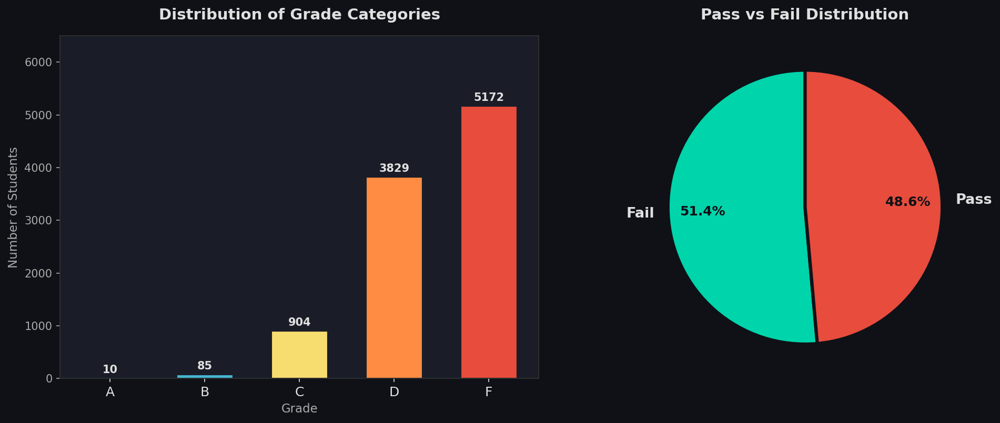
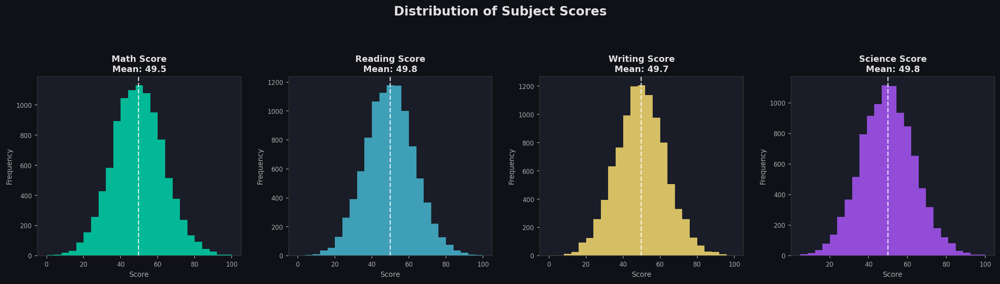
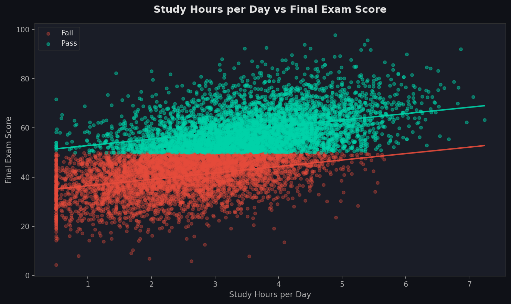
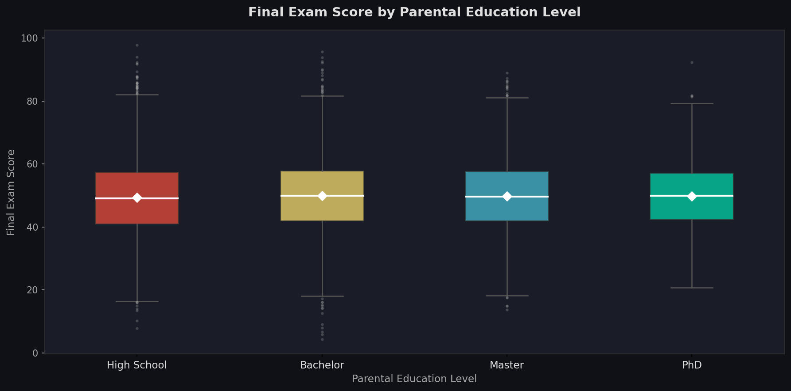

# 📊 EDA Portfolio — Student Exam Performance
### Part 1: Data Analysis and Insight

---

## 1. Data Overview

The **Student Exam Performance** dataset is a comprehensive educational dataset designed to capture factors influencing student academic outcomes — including demographics, family background, study habits, engagement, and academic scores.

| Attribute | Value |
|-----------|-------|
| **Source** | Structured educational sample dataset |
| **Number of Rows** | 10,000 students |
| **Number of Columns** | 23 features |
| **File Format** | Microsoft Excel (.xlsx) |

### Column Categories

| Category | Columns |
|----------|---------|
| **Student Identity** | `student_id`, `gender`, `age` |
| **Family Background** | `parental_education`, `family_income` |
| **Study Habits & Resources** | `study_hours_per_day`, `internet_access`, `study_environment`, `online_courses_completed`, `tutoring` |
| **Engagement Metrics** | `attendance_rate`, `sleep_hours`, `social_media_hours`, `assignment_completion_rate`, `participation_score` |
| **Subject Scores** | `math_score`, `reading_score`, `writing_score`, `science_score`, `final_exam_score` |
| **Academic Outcome** | `previous_gpa`, `pass_fail`, `grade_category` |

---

## 2. Data Cleaning

### 2.1 Missing Values

A systematic check was performed across all 23 columns using `isnull().sum()`:

```
student_id                    0
gender                        0
age                           0
parental_education            0
family_income                 0
internet_access               0
study_environment             0
study_hours_per_day           0
attendance_rate               0
sleep_hours                   0
social_media_hours            0
assignment_completion_rate    0
participation_score           0
online_courses_completed      0
tutoring                      0
math_score                    0
reading_score                 0
writing_score                 0
science_score                 0
final_exam_score              0
previous_gpa                  0
pass_fail                     0
grade_category                0
```

> ✅ **Result:** The dataset contains **zero missing values** across all 23 columns. No imputation or removal was necessary.

### 2.2 Duplicate Rows

A check using `duplicated().sum()`:

```
Duplicated rows: 0
```

> ✅ **Result:** All 10,000 records are **unique entries**. No rows were removed.

### 2.3 Data Quality Summary

| Check | Finding | Action Taken |
|-------|---------|-------------|
| Missing Values | 0 across all 23 columns | None required |
| Duplicate Rows | 0 duplicates | None required |
| Data Types | Consistent (numeric & categorical) | None required |

> 💡 The dataset is clean and ready for analysis with no preprocessing modifications required.

---

## 3. Descriptive Statistics

### 3.1 Numerical Variables Summary

| Variable | Mean | Std Dev | Min | 25% | Median | 75% | Max |
|----------|------|---------|-----|-----|--------|-----|-----|
| Age | 16.49 | 1.12 | 15 | 15 | 16 | 17 | 18 |
| Study Hours / Day | 3.02 | 1.18 | 0.50 | 2.20 | 3.01 | 3.83 | 7.24 |
| Attendance Rate (%) | 84.70% | 9.51% | 50.80% | 78.28% | 85.10% | 91.90% | 100% |
| Sleep Hours | 7.02 | 0.99 | 4.00 | 6.34 | 7.03 | 7.69 | 10.00 |
| Social Media Hours | 2.52 | 1.45 | 0.00 | 1.50 | 2.50 | 3.50 | 8.00 |
| Assignment Completion (%) | 79.49% | 13.76 | 40% | 70.20% | 80% | 90% | 100% |
| **Final Exam Score** | **49.68** | 12.15 | 4.40 | 41.60 | 49.55 | 57.60 | 97.80 |
| Previous GPA | 1.98 | 0.54 | 0.00 | 1.61 | 1.99 | 2.35 | 3.99 |

### 3.2 Categorical Variables Summary

| Variable | Category | Count | Percentage |
|----------|----------|-------|-----------|
| **Gender** | Male | 5,013 | 50.1% |
| | Female | 4,987 | 49.9% |
| **Parental Education** | High School | 3,926 | 39.3% |
| | Bachelor | 3,502 | 35.0% |
| | Master | 2,047 | 20.5% |
| | PhD | 525 | 5.3% |
| **Family Income** | Medium | 5,068 | 50.7% |
| | Low | 2,971 | 29.7% |
| | High | 1,961 | 19.6% |
| **Internet Access** | Yes | 8,986 | 89.9% |
| | No | 1,014 | 10.1% |
| **Study Environment** | Quiet | 4,073 | 40.7% |
| | Moderate | 3,947 | 39.5% |
| | Noisy | 1,980 | 19.8% |
| **Tutoring** | No | 7,004 | 70.0% |
| | Yes | 2,996 | 30.0% |
| **Pass / Fail** | ❌ Fail | 5,142 | 51.4% |
| | ✅ Pass | 4,858 | 48.6% |
| **Grade Category** | F | 5,172 | 51.7% |
| | D | 3,829 | 38.3% |
| | C | 904 | 9.0% |
| | B | 85 | 0.9% |
| | A | 10 | 0.1% |

---

### 3.3 Visualisations

#### Figure 1 — Grade Distribution & Pass/Fail Ratio



The bar chart reveals an extremely skewed grade distribution: 5,172 students (51.7%) received Grade F while only 10 (0.1%) achieved Grade A. The pie chart confirms that 51.4% of students failed the course.

---

#### Figure 2 — Distribution of Subject Scores



All four subject scores (Math, Reading, Writing, Science) display approximately normal (bell-shaped) distributions centered around a mean of ~49–50 points. The uniform spread indicates consistent difficulty levels across disciplines.

---

#### Figure 3 — Study Hours per Day vs. Final Exam Score



Scatter plot colored by Pass (teal) and Fail (red) with trend lines. Both groups show a positive trend — students who study more hours per day consistently score higher. Correlation coefficient: **r = 0.576**.

---

#### Figure 4 — Final Exam Score by Parental Education Level



Box plots compare final exam score distributions across four parental education levels. Median scores are similar (~49–50 across all groups), with diamond markers showing group means.

---

### 3.4 Key Insights

> ### 💡 Key Insight 1: Study Hours is the Strongest Behavioral Predictor of Exam Performance
>
> The correlation analysis reveals that **study hours per day** has the strongest positive relationship with final exam score among all behavioral variables, with a correlation coefficient of **r = 0.576**. As shown in Figure 3, both passing and failing students display clear upward trend lines — those who invest more daily study time consistently achieve higher exam results. This finding implies that **targeted interventions encouraging students to increase their daily study duration** — such as structured study programs, peer study groups, or time-management workshops — could have a meaningful and measurable impact on overall academic outcomes.

---

> ### 💡 Key Insight 2: Academic Outcomes are Severely Skewed Toward Failure Despite Reasonable Attendance
>
> Despite the average student attending **84.7% of classes** and completing **79.5% of assignments**, over **51.7% received a Grade F** and only 48.6% passed overall. This counterintuitive finding is supported by the weak correlation between attendance and final exam score of only **r = 0.151**. This suggests that **attendance and surface-level engagement alone are insufficient predictors of success** — academic quality, depth of focus during study, and active learning behaviors matter far more. Educators should look beyond simple attendance data when identifying and supporting at-risk students.

---

*EDA Portfolio · Part 1: Data Analysis and Insight · Student Exam Performance Dataset (n = 10,000)*
